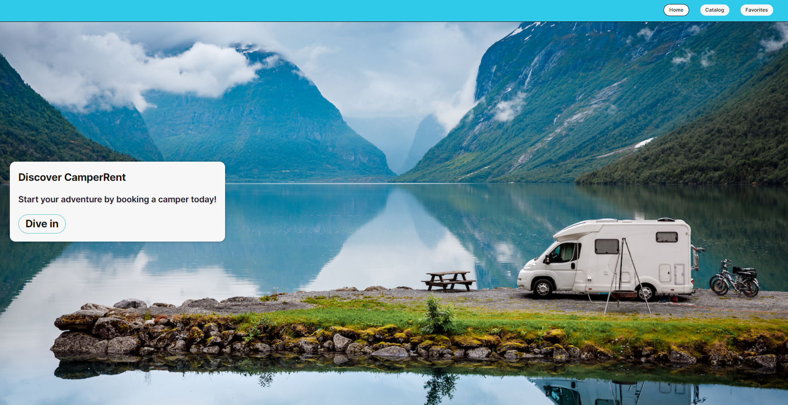
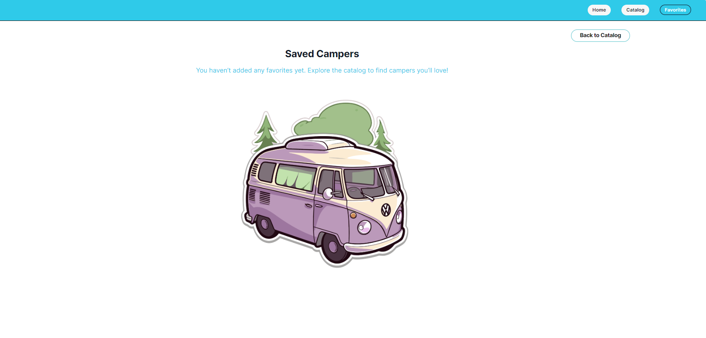
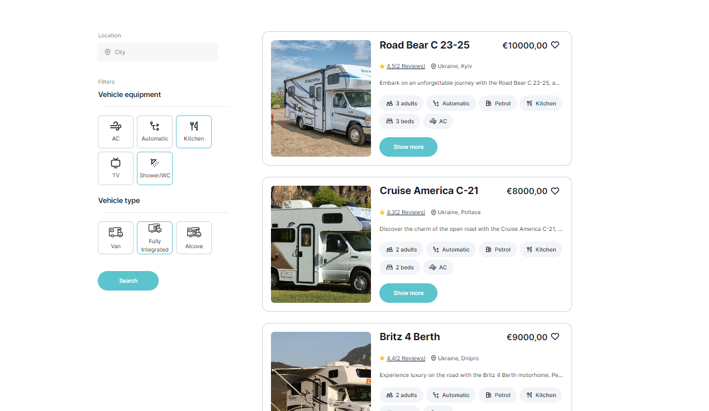
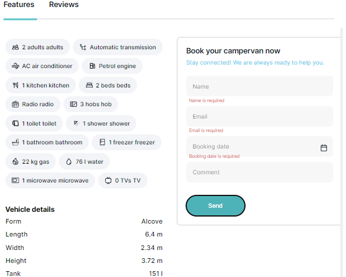
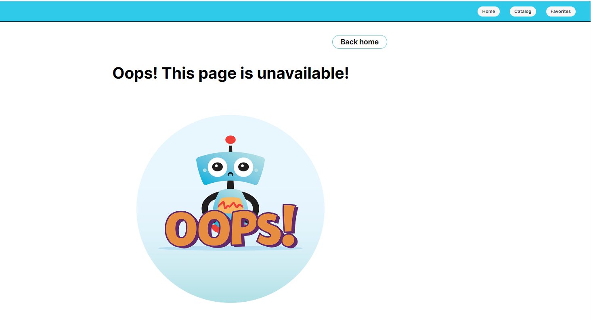
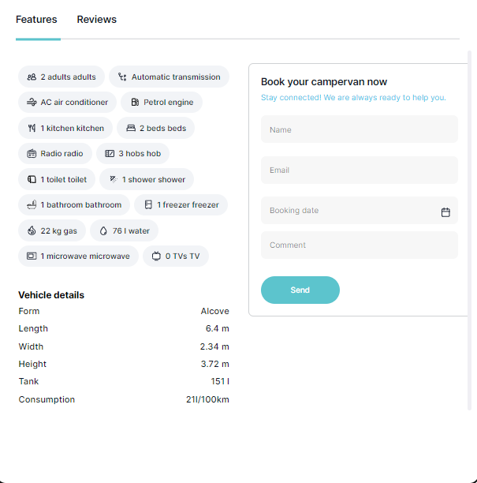
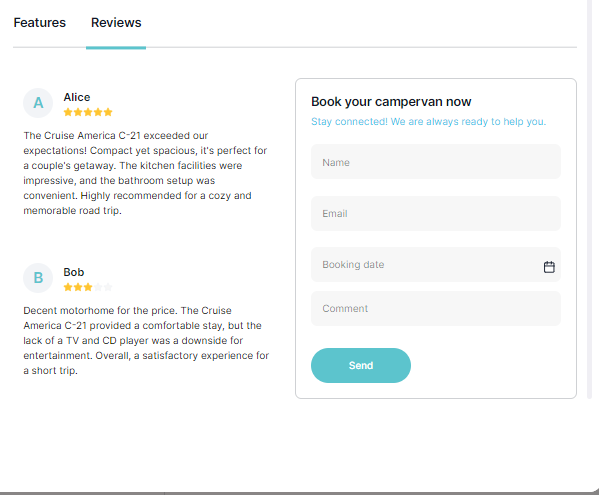

## 🚌 Camper Rent Application

## ✏️ Overview

This project was developed as a technical task for a corporate client. It is a web application designed for a business specializing in camper rentals.

The application is structured into three primary sections:

- `Home Page` This provides a general overview of the services offered by the company.
- `Catalog Page` A detailed catalog of campers available for rent, featuring filtering capabilities based on location, equipment, and type.
- `Favorites Page` A compilation of advertisements that users have marked as favorites.

# 📍Features

-Ad Card: Users have the ability to add or remove ads from their favorites and view detailed camper information within a modal window.

-Pagination: The application displays four ads per page, with a "Load More" button to access additional listings.

-Persistent Favorites: Favorite ads are stored in local storage, ensuring they remain saved even after a page refresh.

-Filtering: Users can refine their search by filtering campers based on location, equipment, and type.

# 💻 Technical Stack:

**:🔸Frontend \***

- `Java Script`
- `React`
- `Redux`
- `React Router`

**:🔸Backend \***
<a href="https://mockapi.io" target="_blank" rel="noreferrer">MockAPI</a>

**:🔸Libraries and Tools \***

- Forms and Validation:
  <a href="https://formik.org" target="_blank" rel="noreferrer">Formik</a> and
  <a href="https://github.com/jquense/yup" target="_blank" rel="noreferrer">Yup</a>

  - Requests:
    <a href="https://axios-http.com" target="_blank" rel="noreferrer">Axios</a>

- Modals:
  <a href="https://github.com/reactjs/react-modal" target="_blank" rel="noreferrer">react-modal</a>

- Date Picker:
  <a href="https://reactdatepicker.com" target="_blank" rel="noreferrer">react-datepicker</a>

  - Loading Spinner:
    <a href="https://mhnpd.github.io/react-loader-spinner/" target="_blank" rel="noreferrer">react-loader-spinner</a>

  - Styling: Custom
    
    and
    <a href="https://github.com/sindresorhus/modern-normalize" target="_blank" rel="noreferrer">modern-normalize</a>

  **:🔸Utilites \***

  

##  🌇Gallery:

